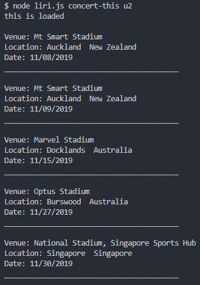
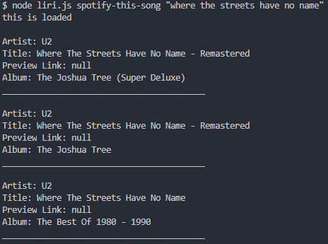
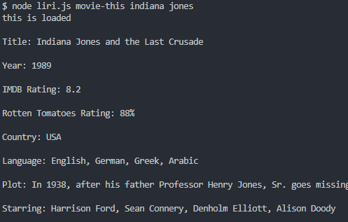
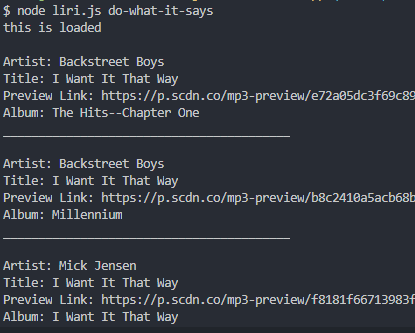

# liri-node-app

# Liri Bot

### Overview

1. Clearly state the problem the app is trying to solve (i.e. what is it doing and why)
2. Give a high-level overview of how the app is organized
3. Give start-to-finish instructions on how to run the app
4. Include screenshots, gifs or videos of the app functioning
5. Contain a link to a deployed version of the app
6. Clearly list the technologies used in the app
7. State your role in the app development

LIRI is a Language Interpretation and Recognition Interface. LIRI is a command line node application that takes in commands and returns data.

LIRI takes in the following commands:

    - [concert-this] : Takes in artist name and returns concert data from Bands In Town API.

    - [spotify-this-song] : Takes in song name and returns song information from Spotify API.

    - [movie-this] : Takes in movie name and reutrns movie information from OMDB API.

    - [do-what-it-says] : Reads [random.txt] file and executes the containing command.

### Instructions

1. Install node.

2. Open terminal.

3. Navigate to folder containing `liri.js` in the terminal.

4. To use [concert-this]:

   - Enter [node liri.js concert-this <band name here>]

   - Example: 

5. To use [spotify-this-song]:

   - Enter [node liri.js spotify-this-song <song name here>]

   - Example: 

6. To use [movie-this]:

   - Enter [node liri.js movie-this <movie name here>]

   - Example: 

7. To use [do-what-it-says]:

   - Enter [node liri.js do-what-it-says]

   - Example: 

   - Update random.txt file to change search parameters.

### Technologies Used

    - JavaScript

    - Node.js

    - Node-Spotify-API

    - Bands In Town API

    - OMDB API

    - Axios

    - Moment.js

    - DotEnv

    - npm

    - GitHub
